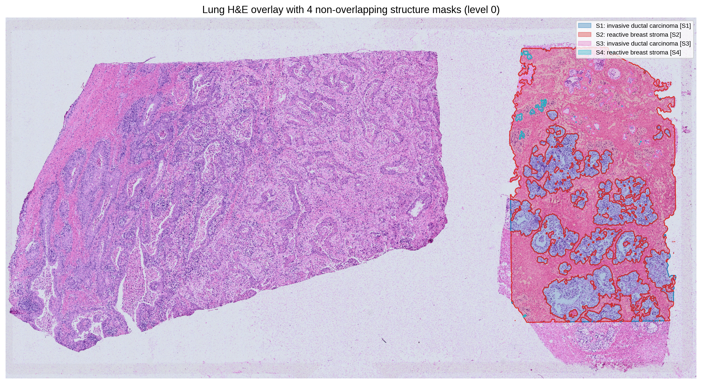
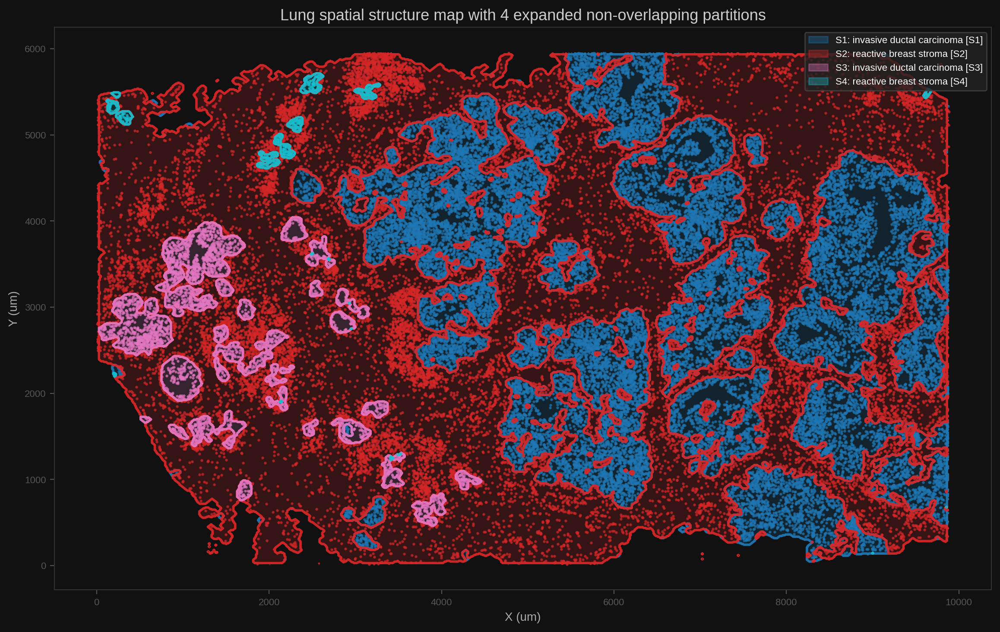

# Atera WTA Breast Cancer on PDC

This tutorial records a reproducible PDC run of Agentic Spatial Pathologist on the 10x Xenium Atera WTA Preview FFPE Breast Cancer dataset, using the local `pathology-ai` backend and pyXenium core workflows.

## Dataset

- PDC dataset: `/cfs/klemming/projects/supr/naiss2025-22-606/data/WTA_Preview_FFPE_Breast_Cancer_outs`
- Local Windows mirror: `Y:\long\10X_datasets\Xenium\Atera\WTA_Preview_FFPE_Breast_Cancer_outs`
- PDC output root: `/cfs/klemming/projects/supr/naiss2025-22-606/results/agentic-spatial-pathologist/atera_wta_breast_pdc_20260429`

The dataset copy contains `cell_feature_matrix.h5`, cell and nucleus boundary parquet files, `cells.parquet`, `experiment.xenium`, `metrics_summary.csv`, `WTA_Preview_FFPE_Breast_Cancer_cell_groups.csv`, and a registered H&E image pyramid under `spatialdata.zarr/images/he`.

## Service Check

The workflow uses the PDC local `pathology-ai` API as the review backend:

```bash
curl http://nid002805:8000/health
```

The completed multimodal run used Slurm job `20163548` on node `nid002805`. The service job later reached its intended 8-hour test limit, but the workflow artifacts below had already been written. The captured `/health` payload during the run was:

```{literalinclude} _static/tutorials/atera_wta_breast_pdc/pathology_ai_health.json
:language: json
```

## Submit the PDC Job

From the PDC login node:

```bash
cd /cfs/klemming/home/h/hutaobo/Agentic-Spatial-Pathologist
git fetch origin
git checkout main
git pull --ff-only origin main

sbatch \
  --export=ALL,PATHOLOGY_AI_BASE_URL=http://nid002805:8000 \
  deploy/pathology_ai/atera_wta_breast_pdc.sbatch
```

The Slurm wrapper creates a venv under the output root, installs `spatho`, `pyXenium`, `histoseg`, and scientific dependencies, clones `sfplot` for `tissue_structure_pipeline`, then runs:

```bash
python scripts/pdc_atera_breast_workflow.py \
  --dataset-root /cfs/klemming/projects/supr/naiss2025-22-606/data/WTA_Preview_FFPE_Breast_Cancer_outs \
  --run-root /cfs/klemming/projects/supr/naiss2025-22-606/results/agentic-spatial-pathologist/atera_wta_breast_pdc_20260429 \
  --sfplot-root /cfs/klemming/projects/supr/naiss2025-22-606/results/agentic-spatial-pathologist/atera_wta_breast_pdc_20260429/deps/sfplot \
  --pathology-ai-base-url http://nid002805:8000
```

## Generated Inputs

The source dataset already has graph-cluster assignments, but it does not include the standard 10x differential-expression and UMAP projection CSVs expected by the full-auto `spatho` workflow. The PDC driver generates:

- `inputs/analysis/clustering/gene_expression_graphclust/clusters.csv`
- `inputs/analysis/diffexp/gene_expression_graphclust/differential_expression.csv`
- `inputs/analysis/umap/gene_expression_2_components/projection.csv`
- `inputs/he/atera_wta_breast_pdc_20260429_registered_he_level6.tif`
- `inputs/he/atera_wta_breast_pdc_20260429_he_alignment_level6.csv`

The differential-expression table is a cluster-pseudobulk log2 fold-change approximation from `cell_feature_matrix.h5`; the projection is derived from cell centroids. The H&E tutorial asset is extracted from `spatialdata.zarr/images/he` level 6 and uses the stored affine transform from image pixel coordinates to Xenium pixel coordinates.

```{literalinclude} _static/tutorials/atera_wta_breast_pdc/generated_inputs_metadata.json
:language: json
```

## Agentic Spatial Pathologist Run

The current workflow config uses the local backend and keeps OpenAI disabled:

```json
{
  "annotation_taxonomy": "breast",
  "pathology_review_backend": "pathology_ai_api",
  "pathology_ai_api_base_url": "http://nid002805:8000",
  "cluster_annotation_backend": "pathology_ai_api",
  "cluster_annotation_llm_base_url": "http://nid002805:8000",
  "he_contour_foundation_enabled": true,
  "he_foundation_model_id": "vinid/plip",
  "he_foundation_prompt_set": "breast_contour_v1",
  "he_visual_override_enabled": true,
  "rna_foundation_enabled": true,
  "rna_foundation_backend": "precomputed_scgpt",
  "rna_foundation_cell_mapping_path": "inputs/foundation/scgpt_cell_mapping.csv",
  "pathway_activity_enabled": true,
  "pathway_activity_csv": null,
  "niche_fusion_enabled": true,
  "niche_fusion_backend": "lightweight",
  "openai_enabled": false
}
```

With `cluster_annotation_backend="pathology_ai_api"`, reruns write `cluster_celltype_annotation.csv` as a conservative consensus: marker-based heuristic labels are reviewed by the local PDC LLM, accepted only when the local model returns a valid controlled-vocabulary label with enough confidence and marker support. The paid OpenAI API is not used.

With `he_contour_foundation_enabled=true`, the workflow follows the pyXenium RNA + contour + H&E pattern: it imports `xenium_explorer_annotations.generated.geojson`, extracts aligned masked H&E contour patches from `spatialdata.zarr/images/he`, classifies those patches locally through PLIP (`vinid/plip`), and asks the local PDC LLM to fuse visual evidence with RNA/cell-type structure evidence for final structure names. Accepted visual overrides are recorded explicitly rather than silently replacing the molecular-only labels.

The readiness check is:

```bash
spatho doctor --config workflows/atera_wta_breast_pdc_20260429_pathology_ai.json
```

The captured doctor output and workflow summary are included here:

```{literalinclude} _static/tutorials/atera_wta_breast_pdc/spatho_doctor.json
:language: json
```

```{literalinclude} _static/tutorials/atera_wta_breast_pdc/spatho/workflow_summary.json
:language: json
```

## scGPT/SpatialFusion-Inspired Evidence Layer

The upgraded workflow can add a foundation evidence layer between cluster annotation and structure-level pathology review. This layer is opt-in and does not change the OpenAI API path or the local `pathology-ai` path.

For this Atera breast run, the intended PDC configuration is:

- `rna_foundation_enabled=true` when a precomputed scGPT/scGPT-spatial cell mapping is available;
- `pathway_activity_enabled=true`, using the generated differential-expression CSV when no pathway activity table is supplied;
- `niche_fusion_enabled=true`, using lightweight fusion of RNA reference evidence, pathway scores, PLIP H&E morphology signals, and spatial structure metadata.

If a real scGPT/scGPT-spatial mapping has not been generated yet, the PDC tutorial driver writes a zero-confidence smoke mapping at `inputs/foundation/scgpt_cell_mapping.csv`. That file validates the data interface and report plumbing only; replace it with a real reference-mapping table before interpreting RNA foundation labels biologically.

The layer writes:

- `foundation/rna_foundation_cluster_summary.csv`
- `foundation/rna_foundation_structure_summary.csv`
- `foundation/pathway_activity_structure_summary.csv`
- `foundation/he_morphology_feature_summary.csv`
- `foundation/niche_fusion_summary.csv`
- `foundation/foundation_evidence_metadata.json`

The method is inspired by scGPT and SpatialFusion, but it remains an auditable workflow layer: frozen/precomputed RNA evidence and H&E foundation-model scores are summarized into standard tables, then the local LLM records whether modalities agree, conflict, or complement each other. It does not train a new joint embedding model in this tutorial pass.

Interpretation policy:

- RNA/cell-type and marker evidence preserve the primary biological identity of each structure.
- PLIP H&E contour evidence contributes morphology, inflammation, tumor, stroma, and artifact signals.
- Pathway activity contributes molecular program context, for example epithelial tumor, proliferation, stromal, immune, or hypoxia programs.
- The local LLM adjudicates consistency: visual evidence can support, qualify, or challenge a label, but conservative thresholds prevent silent replacement.

Selected overlays:





## Local LLM + H&E Foundation Results

The real PDC run classified `2606` aligned H&E contour patches with the local PLIP pathology foundation model (`vinid/plip`) and wrote `2606` contour-level predictions. Those patch-level predictions were aggregated into `7` structure-level visual summaries. The local LLM then fused the PLIP visual evidence with RNA/cell-type/structure evidence for `4` downstream structure names.

The key point is that PLIP is used as local visual evidence, not as an automatic label replacement. The local LLM checks whether the visual foundation-model signal agrees with, contradicts, or complements the molecular interpretation. In this run `accepted_visual_overrides=0`, which is the intended conservative behavior: no H&E-only signal was strong enough, and consistent enough with RNA/cell-type evidence, to replace the molecularly supported IDC or stroma labels.

```{literalinclude} _static/tutorials/atera_wta_breast_pdc/spatho/he_foundation/he_foundation_metadata.json
:language: json
```

Structure-level PLIP aggregation:

```{literalinclude} _static/tutorials/atera_wta_breast_pdc/spatho/he_foundation/he_contour_to_structure_summary.csv
:language: text
```

Local LLM multimodal naming results:

```{literalinclude} _static/tutorials/atera_wta_breast_pdc/spatho/he_foundation/structure_multimodal_names.csv
:language: text
```

Interpretation highlights:

- `S1` kept `invasive ductal carcinoma [S1]`: PLIP flagged artifact/low-quality tissue as the top label, but also found invasive tumor epithelium and DCIS-like contours. The local LLM treated the artifact signal as tissue-quality context and retained the RNA-supported invasive carcinoma interpretation.
- `S2` kept `reactive breast stroma`: PLIP's top visual label was macrophage-rich inflammation, while RNA/cell-type evidence was fibroblast, endothelial, and myofibroblast dominant. The LLM treated the visual inflammation signal as conflicting or secondary context rather than replacing the stromal label.
- `S3` kept `invasive ductal carcinoma [S3]`: PLIP strongly highlighted macrophage-rich inflammation, but RNA evidence was dominated by neoplastic luminal epithelial and invasive carcinoma cells. The LLM interpreted the visual signal as tumor-associated inflammation within IDC.
- `S4` kept `reactive breast stroma [S4]`: PLIP found macrophage/inflammation, vascular, fibrocollagenous, artifact, and necrosis signals, but the LLM confidence for a visual override stayed below threshold and molecular evidence favored a myoepithelial/stromal interpretation.

The result is a complementary multimodal review: the foundation model contributes morphology and tissue-quality signals, while RNA/cell-type evidence preserves the primary biological identity. The local LLM acts as the adjudicator and records why visual evidence is accepted, rejected, or used as context.

Committed lightweight result tables:

- [full PLIP contour classification CSV](_static/tutorials/atera_wta_breast_pdc/spatho/he_foundation/he_contour_classification.csv)
- [full PLIP contour classification JSON](_static/tutorials/atera_wta_breast_pdc/spatho/he_foundation/he_contour_classification.json)
- [H&E contour-to-structure summary CSV](_static/tutorials/atera_wta_breast_pdc/spatho/he_foundation/he_contour_to_structure_summary.csv)
- [H&E contour-to-structure summary JSON](_static/tutorials/atera_wta_breast_pdc/spatho/he_foundation/he_contour_to_structure_summary.json)
- [local multimodal structure names CSV](_static/tutorials/atera_wta_breast_pdc/spatho/he_foundation/structure_multimodal_names.csv)
- [local multimodal structure names JSON](_static/tutorials/atera_wta_breast_pdc/spatho/he_foundation/structure_multimodal_names.json)
- [updated structure reviews CSV](_static/tutorials/atera_wta_breast_pdc/spatho/pathology_review/structure_reviews.csv)
- [updated case summary JSON](_static/tutorials/atera_wta_breast_pdc/spatho/pathology_review/case_summary.json)

## pyXenium Core Results

The same job runs the pyXenium Atera WTA breast LR/pathway topology smoke workflow and a mechanostress snapshot. Full GMI controls are intentionally skipped for this tutorial pass.

Topology report:

```{literalinclude} _static/tutorials/atera_wta_breast_pdc/pyxenium_topology/report.md
:language: markdown
```

Mechanostress report:

```{literalinclude} _static/tutorials/atera_wta_breast_pdc/pyxenium_mechanostress/report.md
:language: markdown
```

Machine-readable summaries:

```{literalinclude} _static/tutorials/atera_wta_breast_pdc/pyxenium_summary.json
:language: json
```

## Artifact Locations

Lightweight tutorial assets are committed under:

`docs/_static/tutorials/atera_wta_breast_pdc/`

Large outputs remain on PDC under:

`/cfs/klemming/projects/supr/naiss2025-22-606/results/agentic-spatial-pathologist/atera_wta_breast_pdc_20260429`

```{literalinclude} _static/tutorials/atera_wta_breast_pdc/artifact_index.json
:language: json
```
