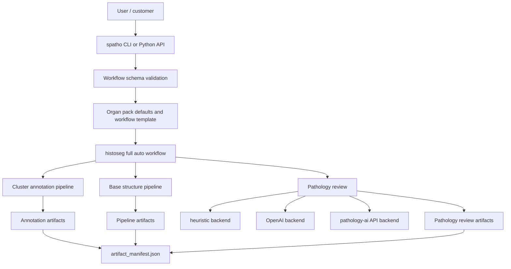

# AI-Driven Spatial Pathologist Development Guide

This document is the detailed handoff for `spatho` as it exists today.
It is written for future development work: new contributors should be able to read this file and understand what the project currently owns, what is still delegated to `histoseg`, how the major interfaces fit together, and where the next sensible development seams are.

Current snapshot:

- package: `spatho`
- current public version: `0.1.0`
- role: public-facing product layer for the AI-driven spatial pathologist workflow
- current engine dependency: `histoseg>=0.1.9.1`
- current primary input assumption: Xenium-style output directories plus a base pipeline config

## 1. Product Intent

`spatho` is not the low-level segmentation engine.
It is the product layer above the engine.

The intended user experience is:

1. initialize a workflow for a case
2. validate environment and inputs
3. run a full analysis
4. inspect human-readable reports and machine-readable artifacts
5. reuse the same workflow contract across organ-specific presets

Today that product contract already exists, but a meaningful part of execution still happens in `histoseg`.

## 2. Repository Boundaries

The current system spans multiple repositories and services.
Understanding those boundaries is the most important prerequisite for future work.

### `spatho` repo

Repo:

- `D:\GitHub\AI-Driven-Spatial-Pathologist`

Owns:

- public package name and packaging
- CLI and Python API
- workflow schema
- workflow templates
- organ packs
- artifact manifest
- public docs, roadmap, commercialization plan
- release and PyPI publishing setup

Does not yet own:

- low-level segmentation logic
- full cluster annotation implementation
- pathology review engine internals
- H&E overlay generation

### `histoseg` repo

Repo:

- `D:\GitHub\HistoSeg`

Currently owns the actual execution path behind `spatho run`, including:

- annotation pipeline orchestration
- evidence-pack building
- OpenAI-driven annotation
- base pipeline execution
- structure discovery and report generation
- pathology review backends

Key modules:

- `D:\GitHub\HistoSeg\src\histoseg\annotation`
- `D:\GitHub\HistoSeg\src\histoseg\spatial_pathologist`

### `segmentation_methods` project repo

Repo:

- `D:\GitHub\sfplot\segmentation_methods`

This still provides case configs, references, and some pipeline code/assets used during real runs.
It is still part of the effective runtime surface even though it is not the public product repo.

### `pathology-ai` service

Repo/service:

- `C:\Users\taobo.hu\Projects\pathology-ai`

This is an optional pathology review backend used through HTTP when `pathology_review_backend = "pathology_ai_api"`.
It is not bundled into `spatho`; it is treated as an external local service.

## 3. Current High-Level Architecture



The most important architectural reality today is:

- `spatho` defines the public contract
- `histoseg` executes that contract

That is acceptable for `v0.1.x`, but the long-term direction is to invert that relationship so `histoseg` becomes a narrower engine dependency.

## 4. Current Public Interfaces

### CLI

Entry point:

- `D:\GitHub\AI-Driven-Spatial-Pathologist\src\spatho\cli.py`

Commands currently exposed:

- `spatho run`
- `spatho init-workflow`
- `spatho doctor`
- `spatho list-organ-packs`
- `spatho config-schema`
- `spatho build-manifest`

Current CLI philosophy:

- keep the user contract simple
- accept a workflow JSON as the main unit of execution
- print JSON results for composability

### Python API

Primary surface:

- `D:\GitHub\AI-Driven-Spatial-Pathologist\src\spatho\api.py`

Exported functions:

- `run_workflow`
- `workflow_doctor_report`
- `list_available_organ_packs`
- `init_workflow`
- `write_schema`
- `build_manifest`

Current behavior:

- validate config with Pydantic
- delegate workflow execution to `histoseg.spatial_pathologist.full_auto`
- write an artifact manifest after workflow completion

### Legacy deployment surface

Legacy app:

- `D:\GitHub\AI-Driven-Spatial-Pathologist\main.py`

This should be treated as a deployment surface, not the product definition.
The core public interface should continue to be the package in `src/spatho`.

## 5. Workflow Contract

### Canonical config model

Schema source:

- `D:\GitHub\AI-Driven-Spatial-Pathologist\src\spatho\schema.py`

Formal exported schema:

- `D:\GitHub\AI-Driven-Spatial-Pathologist\schemas\workflow.schema.json`

The `WorkflowConfig` model currently defines:

- case identity
- study context
- base pipeline config path
- output root
- organ taxonomy
- pathology review backend settings
- OpenAI settings
- annotation thresholds
- structure review thresholds

Important design choices:

- `extra="forbid"` keeps the config strict
- relative paths are resolved relative to the workflow JSON location
- `annotation_taxonomy` is validated against registered organ packs
- `pathology_review_backend` is explicitly constrained to:
  - `heuristic`
  - `openai`
  - `pathology_ai_api`

### Workflow templates

Template builder:

- `D:\GitHub\AI-Driven-Spatial-Pathologist\src\spatho\templates.py`

Current template behavior:

- auto-fills Xenium differential expression CSV path
- auto-fills Xenium UMAP projection path
- applies organ-pack workflow defaults
- defaults pathology review backend to `openai`
- enables recomputation by default in generated templates

This is intentionally opinionated and currently optimized for internal/project use rather than maximum generality.

## 6. Organ Packs

Registry:

- `D:\GitHub\AI-Driven-Spatial-Pathologist\src\spatho\organ_packs\registry.py`

Current bundled packs:

- `lung`
- `breast`

Backing data:

- `D:\GitHub\AI-Driven-Spatial-Pathologist\src\spatho\organ_packs\data\lung.json`
- `D:\GitHub\AI-Driven-Spatial-Pathologist\src\spatho\organ_packs\data\breast.json`

Each organ pack currently carries:

- `id`
- `display_name`
- `annotation_taxonomy`
- `description`
- `default_study_context`
- `supported_input_layout`
- `workflow_defaults`
- `artifact_contract`

Why this matters:

- organ packs are the current public abstraction for organ-specific defaults
- they are the natural place to keep public-safe rules and metadata
- they are also the natural future extension point for additional organs or disease programs

Important current limitation:

- organ packs are metadata packs, not full plugin modules
- the actual downstream biology/pathology logic still lives mostly in `histoseg` and the sibling project assets

## 7. End-to-End Execution Path

### Public entry

`spatho run` and `run_workflow()` both end up here:

- `D:\GitHub\AI-Driven-Spatial-Pathologist\src\spatho\api.py`

### Execution delegation

`run_workflow()` currently does three high-level things:

1. validate workflow JSON using `WorkflowConfig`
2. optionally disable OpenAI if `heuristic_only=True`
3. call `histoseg.spatial_pathologist.full_auto.run_full_auto_spatial_pathologist`

### `histoseg` full-auto runner

Current implementation:

- `D:\GitHub\HistoSeg\src\histoseg\spatial_pathologist\full_auto.py`

The current full-auto sequence is:

1. load base pipeline config
2. infer or resolve `differential_expression.csv`
3. infer or resolve `projection.csv`
4. run cluster annotation pipeline
5. write a generated runtime base config
6. ensure base pipeline outputs exist
7. run structure-level pathology review
8. write `workflow_summary.json`

### Annotation step

Delegated to:

- `histoseg.annotation.run_cluster_annotation_pipeline`

Inputs include:

- cluster CSV
- differential expression CSV
- projection CSV
- taxonomy choice
- OpenAI settings

Outputs include:

- cluster evidence JSON
- cluster annotations JSON/CSV
- compatibility annotation CSV
- annotation case review JSON
- annotation HTML report

### Base spatial pipeline step

Still driven through the generated runtime base config and current pipeline assets.
This is where structure assignment, clustermap generation, and validation overlays happen.

### Pathology review step

Delegated to:

- `D:\GitHub\HistoSeg\src\histoseg\spatial_pathologist\runner.py`

This builds a case bundle and then performs:

- cluster review
- structure review
- case summary
- HTML report writing

## 8. Pathology Review Backends

This is currently the most important configurable branch in the product.

### `heuristic`

Behavior:

- fully local
- no LLM dependency
- deterministic baseline summaries and review priorities

Use case:

- smoke tests
- offline operation
- fallback mode when model/API access is unavailable

### `openai`

Behavior:

- uses structured JSON outputs
- cluster review, structure review, and case summary all go through the OpenAI backend
- falls back to heuristics if calls fail

Current implementation path:

- `D:\GitHub\HistoSeg\src\histoseg\spatial_pathologist\openai_client.py`
- `D:\GitHub\HistoSeg\src\histoseg\spatial_pathologist\runner.py`

Important notes:

- `spatho` itself does not directly call the OpenAI API
- it passes provider settings through to `histoseg`
- `openai_store` is already part of the contract and defaults to `false`

### `pathology_ai_api`

Behavior:

- uses the local `pathology-ai` service for structure-level and case-level pathology interpretation
- cluster cell-type annotation can also use local LLM refinement when `cluster_annotation_backend = "pathology_ai_api"`
- without that explicit annotation backend, cluster review remains the existing heuristic/OpenAI path
- merges textbook-grounded answers and citations into the structure and case results

Current implementation path:

- `D:\GitHub\AI-Driven-Spatial-Pathologist\src\spatho\local_annotation.py`
- `D:\GitHub\AI-Driven-Spatial-Pathologist\src\pathology_ai_service\server.py`
- `D:\GitHub\HistoSeg\src\histoseg\spatial_pathologist\pathology_ai_api.py`
- `D:\GitHub\HistoSeg\src\histoseg\spatial_pathologist\runner.py`

Current assumptions:

- service base URL defaults to `http://127.0.0.1:8000`
- service exposes `/health`
- cluster annotation requests use `/annotations/cluster`
- review requests are phrased as pathology questions over a structure or whole-case evidence bundle

This backend is the newest review path and should be considered an active development area.

## 9. Artifact Contract

Artifact manifest implementation:

- `D:\GitHub\AI-Driven-Spatial-Pathologist\src\spatho\manifest.py`

Primary output:

- `artifact_manifest.json`

Current required artifact categories:

- workflow
- annotation
- pathology
- pipeline

Representative tracked artifacts:

- `workflow_summary.json`
- generated runtime config
- cluster evidence JSON
- cluster annotations JSON/CSV
- compatibility annotation CSV
- annotation HTML report
- pathology HTML report
- structure reviews JSON
- case summary JSON
- structure clustermap PDF
- cluster-structure lookup CSV
- structure assignment summary JSON
- Xenium explorer annotation summary CSV

Why the manifest matters:

- it makes the workflow outputs inspectable programmatically
- it is the current best foundation for future service-mode delivery
- it is the natural place to attach future metadata such as billing, provenance, and schema versions

Current limitation:

- manifest versioning is still minimal
- report schemas and workflow compatibility rules are not yet formally versioned end-to-end

## 10. Testing and CI

Current tests:

- `D:\GitHub\AI-Driven-Spatial-Pathologist\tests\test_api.py`

What is currently covered:

- schema validation behavior
- doctor checks for missing inputs
- workflow template generation
- organ-pack exposure
- schema export
- artifact manifest generation

What is not yet sufficiently covered:

- real CLI subprocess smoke tests
- cross-repo integration runs
- pathology backend mocking
- regression tests for generated report shape/content
- fixture-based tiny cases

Current CI:

- package/test workflow under `.github/workflows`
- PyPI publish workflow under `.github/workflows/publish-pypi.yml`

## 11. Packaging and Release State

Packaging config:

- `D:\GitHub\AI-Driven-Spatial-Pathologist\pyproject.toml`

Important current facts:

- package name on PyPI: `spatho`
- current version source: `src/spatho/__init__.py`
- release workflow uses GitHub Actions Trusted Publishing
- current license marker is non-commercial research use oriented

Current production reality:

- public install works
- the package is still alpha
- runtime behavior still depends heavily on `histoseg` and existing project configuration patterns

## 12. Current Known Technical Debt

These are the most important current debt items.

### Cross-repo coupling

`spatho` is public-facing, but large parts of real execution still depend on:

- `histoseg`
- `sfplot/segmentation_methods`

This makes public onboarding harder and complicates reproducibility for outside users.

### Public contract vs execution ownership mismatch

`spatho` owns the public interface, but not enough of the implementation.
That is acceptable temporarily, but over time it increases maintenance cost and confusion.

### Legacy deployment surface ambiguity

`main.py` still exists and can confuse future contributors about what the primary product surface is.

### Limited fixture coverage

The repo currently lacks a small, stable public fixture set for repeatable workflow tests.

### Provider abstraction is incomplete

The workflow contract already expresses different review backends, but provider logic is not yet abstracted at the `spatho` layer in a clean interface.

### Config compatibility policy is not fully formalized

There is a schema, but not yet a clearly documented migration/versioning policy for workflow files.

## 13. Recommended Next Development Priorities

These are the most leverage-positive next steps.

### Priority 1: document and stabilize compatibility boundaries

Do next:

- define which fields in `WorkflowConfig` are public and stable
- define compatibility rules for new config versions
- add a `workflow_schema_version`

### Priority 2: reduce runtime dependence on sibling project structure

Do next:

- move public-safe pipeline configuration helpers into `spatho`
- progressively reduce assumptions that configs live under internal project layouts

### Priority 3: formalize provider abstraction

Do next:

- define a stable review-provider interface
- make `openai`, `heuristic`, and `pathology_ai_api` first-class interchangeable providers at the product layer
- prepare for future providers such as Anthropic or local models

### Priority 4: add fixture-backed integration tests

Do next:

- create tiny public-safe test fixtures
- add smoke tests for `spatho init-workflow`, `spatho doctor`, and `spatho run`
- mock OpenAI and pathology-ai responses

### Priority 5: improve artifact and report versioning

Do next:

- add explicit manifest schema version evolution rules
- add report schema/version metadata
- distinguish required vs optional artifacts more formally

### Priority 6: separate community and commercial layers cleanly

Do next:

- keep the local CLI and organ packs public
- move organization, billing, hosted inference, and deployment surfaces into a separate service layer

## 14. Suggested Contributor Workflow

When changing `spatho`, future contributors should follow this order:

1. decide whether the change belongs in `spatho` or `histoseg`
2. if it changes public behavior, update `WorkflowConfig` and docs first
3. if it changes outputs, update the artifact manifest logic or contract notes
4. add or extend tests in `tests/test_api.py`
5. keep the CLI and Python API aligned

Useful heuristic:

- if the change is about public workflow UX, packaging, config, organ packs, manifests, or docs, it probably belongs in `spatho`
- if the change is about segmentation, evidence extraction, report generation internals, or provider execution details, it may still belong in `histoseg` today

## 15. Practical Commands

Local editable install:

```bash
pip install -e D:\GitHub\HistoSeg
pip install -e D:\GitHub\AI-Driven-Spatial-Pathologist
```

Run tests:

```bash
python -m pytest D:\GitHub\AI-Driven-Spatial-Pathologist\tests
```

Check workflow readiness:

```bash
spatho doctor --config D:\GitHub\HistoSeg\workflows\breast_s1_top_graphclust_full_auto_openai.json
```

Run a workflow:

```bash
spatho run --config D:\GitHub\HistoSeg\workflows\breast_s1_top_graphclust_full_auto_openai.json
```

Export schema:

```bash
spatho config-schema --output D:\GitHub\AI-Driven-Spatial-Pathologist\schemas\workflow.schema.json
```

## 16. Short Summary

The current `spatho` project is already a real public package, but it is still a product-layer wrapper over `histoseg`.
That is the central fact future development needs to respect.

The right near-term strategy is not to rewrite everything at once.
It is to keep strengthening `spatho` as the public contract while gradually migrating product-owned logic out of `histoseg` and reducing dependence on internal project layouts.
