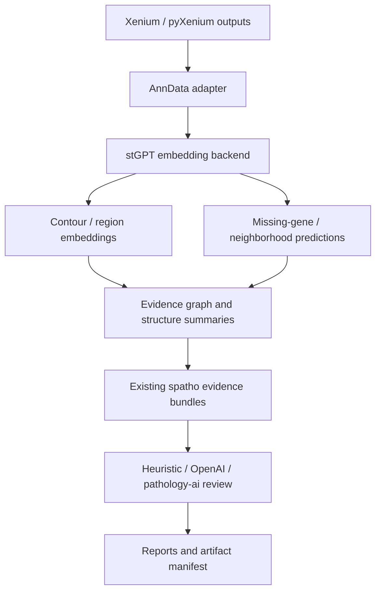

# stGPT Upgrade Plan

This note captures how `spatho` can evolve from an AI-assisted Xenium spatial pathology workflow into an evidence-generating agentic workbench over stGPT: a spatial transcriptomics foundation-model evidence engine that can enrich structure discovery, cluster annotation, missing-gene reasoning, and pathology review.

The concise platform narrative is:

> stGPT learns reusable contour/region morpho-molecular representations; spatho plans, validates, and turns them into auditable spatial pathology evidence.

## Source Read

Primary sources reviewed:

- scGPT official repository: https://github.com/bowang-lab/scGPT
- scGPT paper: https://www.nature.com/articles/s41592-024-02201-0
- scGPT-spatial official repository: https://github.com/bowang-lab/scGPT-spatial
- scGPT-spatial preprint record: https://sciety.org/articles/activity/10.1101/2025.02.05.636714
- Hugging Face paper search for adjacent ST foundation models, including ST-Align, SToFM, HESCAPE, and SEAL.

The strongest practical path is not to rewrite scGPT from scratch. It is to treat scGPT-spatial as the reference upgrade path from single-cell GPT to spatial transcriptomics GPT, then wrap it behind a `spatho`-owned interface.

## What scGPT Gives Us

scGPT models one cell as a gene-token sequence with expression values. Its core value for `spatho` is a pretrained gene and cell representation space that can support:

- cell or spot embeddings
- cell type annotation
- batch and multi-omic integration
- perturbation and gene network tasks
- transfer learning from a large single-cell corpus

The official scGPT repository provides pretrained checkpoint links and a Python package, but its model zoo is still primarily distributed through external downloads rather than as ordinary Hugging Face model repositories.

## What scGPT-spatial Adds

scGPT-spatial is the more direct stGPT substrate. It continues pretraining from scGPT on spatial transcriptomics profiles and adds:

- spatial corpus pretraining across Visium, Visium HD, Xenium, and MERFISH
- a Mixture-of-Experts expression decoder for protocol-aware prediction
- spatially aware sampling
- neighborhood-based reconstruction for local tissue context
- zero-shot embeddings for multi-slide and cross-modality integration
- downstream support for deconvolution and contextualized missing-gene imputation

The public `scGPT-spatial` code currently exposes an inference path around `scgpt_spatial.tasks.embed_data()`, expecting a checkpoint folder with `vocab.json`, `args.json`, `best_model.pt`, and gene statistics.

## Current `spatho` Gap

`spatho` currently owns workflow UX, organ packs, artifact manifests, H&E contour evidence, local pathology AI review, and Xenium alignment notes. It does not yet own a transcriptomic foundation-model encoder.

Today the molecular evidence flow is mostly:

1. read Xenium-derived cluster and differential-expression artifacts
2. build marker and spatial structure evidence
3. ask a heuristic, OpenAI, or local pathology-AI backend to review
4. produce reports and manifests

The missing stGPT layer is a learned embedding and reconstruction layer between raw Xenium expression data and the existing cluster/structure/review surfaces.

## Proposed Architecture



The adapter should keep `spatho` stable even if the upstream scGPT-spatial package changes.

The repo-level architecture should be described as:

- `stGPT Foundation`: training, model architecture, checkpoint loading, embedding, and model packaging.
- `stGPT Evidence Suite`: QC, deterministic splits, benchmarks, ablations, failure analysis, and domain-shift checks.
- `stGPT Runtime / Tool API`: callable tools such as `embed_cells`, `evaluate_checkpoint`, `package_model`, and `export_spatho_artifacts`.
- `spatho Agentic Workbench`: guardrailed workflow orchestration and human-review handoff.
- `spatho Reports`: reproducible evidence reports that distinguish measured data from model-derived evidence.

The agentic fusion loop should be:

```text
Plan -> Tool Calls -> QC/Critic -> Evidence Graph -> Report -> Human Review -> Model Improvement
```

In this loop, `stGPT` is a callable, schema-first evidence toolchain. `spatho` plans valid analysis routes, runs readiness checks, calls the toolchain or consumes precomputed artifacts, evaluates QC, and only then turns compact summaries into report language. The LLM or local pathology reviewer should receive structured evidence bundles, not raw vectors.

## Implementation Phases

### Phase 0: Keep Boundaries Clean

Keep the package name `spatho`. Add an optional module namespace:

- `spatho.stgpt`
- optional extra: `spatho[stgpt]`
- no hard dependency on CUDA, flash-attn, scanpy, or scGPT-spatial for normal installs
- user-supplied checkpoint folder rather than bundled weights

Initial config fields can be added once behavior exists:

- `stgpt_enabled`
- `stgpt_model_dir`
- `stgpt_device`
- `stgpt_gene_column`
- `stgpt_batch_size`
- `stgpt_max_length`

### Phase 1: Xenium to AnnData Contract

Create a deterministic conversion layer from the current Xenium inputs to `AnnData`.

Minimum contract:

- `adata.X`: cell-by-gene expression matrix
- `adata.obs["cell_id"]`
- `adata.obs["cluster_id"]`
- `adata.obs["x_um"]` and `adata.obs["y_um"]`
- `adata.obsm["spatial"]`
- `adata.var["feature_name"]`
- optional `adata.obs["structure_id"]` after structure assignment

Protein features should remain traceable as a separate modality and should not be flattened silently into gene names.

### Phase 2: Region-First stGPT Embeddings MVP

Build the first useful integration around region- and structure-level stGPT artifacts. Cell embeddings remain useful as a compatibility and provenance layer, but pathology review should primarily consume contour, region, and structure summaries.

Current stable handshake:

- `stgpt.runtime.export_spatho_artifacts(config, checkpoint, output_dir, batch_size=32, device="auto")`

Preferred target artifacts:

- `region_embeddings.parquet`
- `region_cell_membership.parquet`
- `region_molecular_summary.parquet`
- `region_image_manifest.json`
- `region_qc_report.json`
- `evidence_manifest.json`

Compatibility artifacts:

- `stgpt/cell_embeddings.parquet`
- `stgpt/structure_embedding_summary.csv`
- `stgpt/qc_report.json`

MVP acceptance criteria:

- runs without changing existing `spatho run`
- works on a small Xenium fixture or generated AnnData fixture
- writes deterministic artifact manifests and evidence IDs
- can be disabled cleanly when optional dependencies are absent
- preserves clear measured-vs-model-derived labels for reconstruction or imputation

### Phase 3: Feed stGPT Evidence Into Reviews

After embeddings exist, inject summaries into the existing evidence bundles:

- region and structure centroid embeddings
- nearest-neighbor relationships across structures, contours, and slides
- embedding coherence per cluster, region, and structure
- outlier regions, ambiguous boundary cells, or weakly supported contours
- spatial-neighborhood agreement score
- optional missing-gene predictions for markers absent from targeted panels

The pathology reviewer should receive compact structured evidence, not raw vectors. A preferred evidence object should include `evidence_id`, `unit`, `unit_id`, `source`, `evidence_type`, `measured`, `model_derived`, `qc_status`, `summary`, and `supporting_artifacts`.

### Phase 4: Spatial Fine-Tuning on Local Data

Only after the zero-shot path is useful, add a PDC/HPC fine-tuning recipe:

- initialize from scGPT-spatial V1 checkpoint
- curate local Xenium, Visium, MERFISH, or WTA spatial data into a shared AnnData layout
- keep protocol labels for MoE routing or batch embeddings
- use spatial-neighborhood reconstruction for context
- evaluate held-out slides and organs

Candidate metrics:

- cell-type ARI/NMI against curated labels
- batch mixing and biological conservation from scIB-style metrics
- masked-gene imputation Pearson/Spearman and MSE
- neighborhood label agreement
- downstream report stability and reviewer confidence changes

### Phase 5: True stGPT Product Layer

The long-term `stGPT` layer should become a product capability, not just a model wrapper.

Target capabilities:

- foundation-model enhanced structure discovery
- cross-slide and cross-modality alignment
- targeted-panel missing-gene support
- spatial neighborhood and niche summarization
- optional H&E and transcriptome alignment, likely through a later multimodal model rather than scGPT-spatial alone

## Risks

- Upstream scGPT-spatial has no packaged release at the time of review.
- Model weights are on figshare rather than ordinary Hugging Face model repos.
- Processed SpatialHuman30M data availability depends on original dataset licenses.
- `flash-attn` and CUDA constraints can make installation fragile.
- Xenium targeted panels may have limited overlap with the pretrained vocabulary.
- Raw cell-level embeddings are large; summaries need to stay compact.
- Medical/pathology review must treat stGPT outputs as evidence, not diagnosis.

## Recommended Next Step

Implement Phase 1 and Phase 2 as an optional, read-only evidence path. That gives `spatho` immediate value from scGPT-spatial without disturbing current workflows, and it creates the artifact contract needed for later fine-tuning or full stGPT productization.
